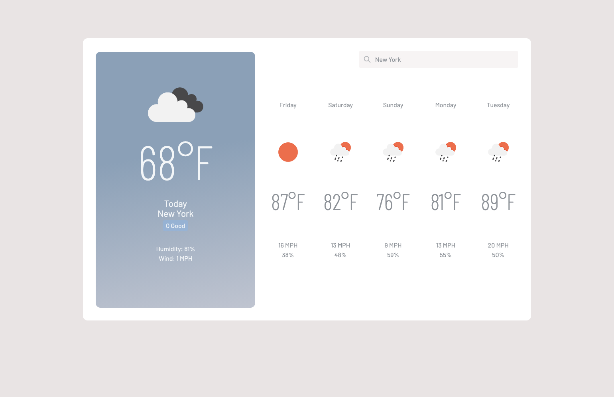

# Weather Dashboard

## Description

The weather dashboard displays a searched location's weather and its five-day forecast. It uses the OpenWeather API to pull a location's temperature, UV index, humidity, windspeed, and associated weather icon. A color badge will display depending on which category the UV index falls into: low, medium, or high.

Previously searched locations are saved to local storage and can be accessed from the search input dropdown. If no saved locations exist, "New York" will automatically be entered as the search. 

[https://kimcc.github.io/weather-dashboard](https://kimcc.github.io/weather-dashboard)

## Tools
- OpenWeather API
- Tailwind CSS